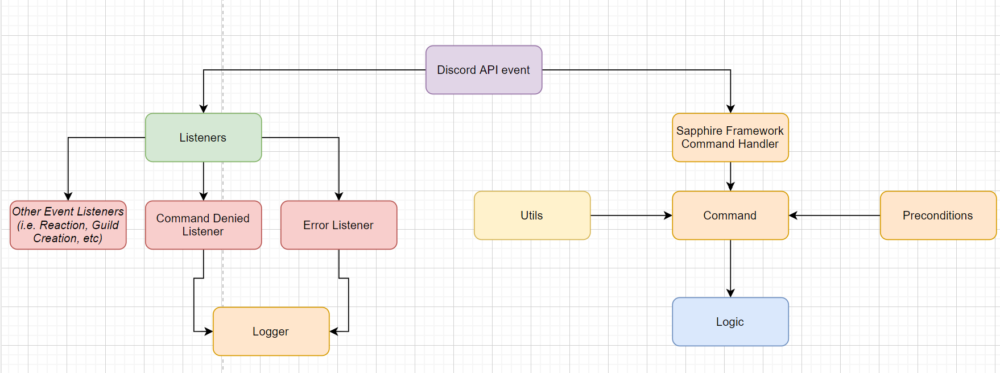

# BediBot Rewrite

This is a rewrite of the BediBot Discord Bot written in TypeScript using the Sapphire Discord bot framework.

## Adding the bot to a server
- Ensure you have system messages enabled in your server
- Click on this invite link [here](https://discord.com/oauth2/authorize?client_id=873657761391587429&permissions=8&scope=bot%20applications.commands)
- Run $help to see the available commands

## Dev Environment Setup

- Install [node.js](https://nodejs.org/en/) (16.6.1)
- Install clang-format globally by running `npm install -g clang-format`
- Run `npm install` in the project directory to automatically install dependencies in `package.json`
- Update environment variables in `.env`

## Architecture 

The bot's architecture revolves around using Sapphire's discord bot framework to provide structure for command handling. This framework is built on top of discord.js. 

## Running the Bot

- Run the `run.sh` script in the scripts folder to start the bot.

## Workflow

Do NOT commit to main under any circumstances.

- Open a PR against main and request reviews if desired.
- Run the `format.sh` script in the scripts folder to format the code appropriately.
- Squash and merge is the preferred method of merging code
- Resolve merge conflicts on local before PR'ing
- PRs without unit tests will **NOT** be approved

## Contributors

Active Developers: Aadi Chaudhary, Sahil Kale, Zayd Tahir

Additional Contributors: Carson Bay, Leo Gabriel, Joe Ma

Please contact if you'd like to use any part of this code in your own repo :)
